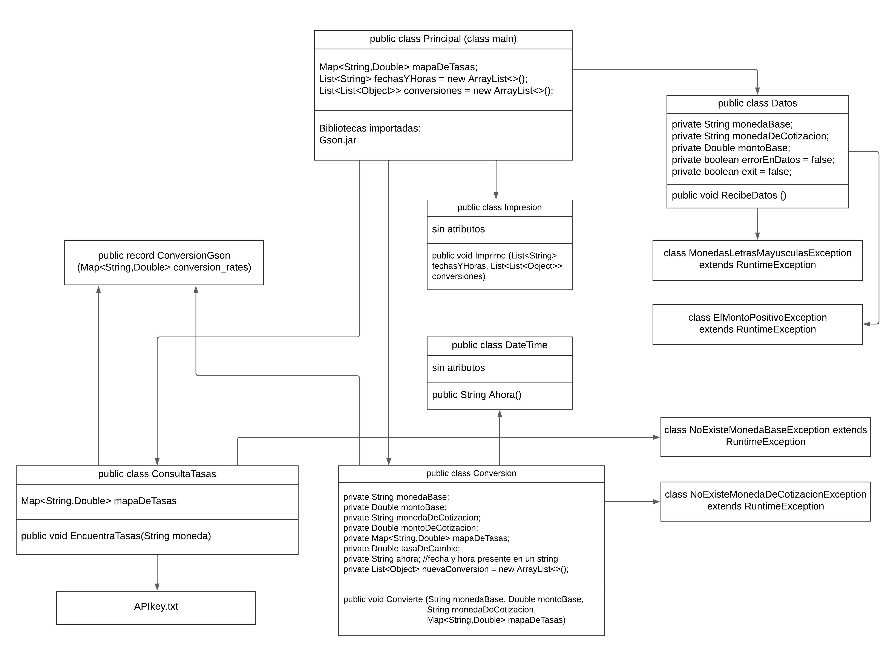

# Conversor de monedas

  

Esta aplicación hace la conversión entre cualquieras dos monedas de la lista de ISO 4217 (Three Letter Currency Code) que los cubre exchangerate-api.com.

## Descripción del proyecto
Esta aplicación fué la tarea (Challenge) en ONE (Oracle Next Eucation) en la formación de Java orientado a objetos. 

En este proyecto se incluyeron procesos muy importantes de programación en Java.

- Definición y uso de Modelos
- Definición y uso de una API 
- Uso de Biblioteca Gson.jar
- Definición y uso de clase tipo record
- Manejo de errores/excepciones

Realizando el proyecto me enfoqué a:
- hacer las clases modelos independientes
- cubrir todos los requerimientos del Challenge e
- implementar las mejoras:
    - el usuario puede pedir la conversión entre cualquieras dos monedas que cubre exchangerate-API.com
    - se guardan todas las conversiones y se imprime el reporte en el final
    - en el reporte se incluye la fecha y la hora de cada conversión

## Organización de código
La aplicación está organizada en tres paquetes (package):
- principal
    - Principal.java
        - Conversor hace varias conversiones de monedas, datos ingresados desde teclado. En el final imprime todas las conversiones hechas con fechas y horas de realización.
- modelos
    - Datos.java
        - Clase Datos se encarga de proporcionar datos para converción
        - Método RecibeDatos() lee datos ingresados del teclado y nos proporciona: moneda base, moneda de cotizacion y monto para convertir. En caso de error de teclado regresa valor errorEnDatos = true y la clase Principal (main) retoma el proceso desde inicio. En caso de precionar Enter sin escribir regresa valor exit = true y la clase Principal(main) toma el proceso para terminar.
    - ConversionGson.java
        - Es un public record que está responsable de convertir un Json en el mapa de pares de moneda y su tasa de cambio en relación con la moneda base requerida.
    - ConsultaTasas.java
        - Clase ConsultaTasas está encargada de obtener datos de exchangerate-api.com.
        - Método EncuentraTasas recibe el parametro moneda en el estándar ISO 4217, lee el API key del archivo APIkey.txt, encuentra la tabla completa de tasas de cambio en Json de exchangerate-api.com y la convierte en mapa de pares de moneda y su tasa de cambio.
    - Conversion.java
        - Clase Conversión está encargada de hacer la conversión requerida.
        - Método Convierte es un método independiente que recibe cuatro parametros: moneda base, monto base, moneda de cotización y el mapa de tasas de cambio. El resultado que proporciona es la lista que contiene estos cuatro datos y el monto de conversión y la lista de fecha y hora de la conversion.
    - DateTime.java
        - Clase DateTime está responsable de fecha y hora de la conversión.
        - Método Ahora copia la fecha y la hora del sistema en el momento de la conversión y las devuelve como un string formateado.
    - Impresion.java
        - Clase Impresión está encargada de la impresión final.
        - Método Imprime obtiene dos parametros: la lista de strings que contienen la fecha y la hora de las conversiones y la lista de los datos de cada conversión que también son listas. El resultado es la impresión de todas las conversiones con sus fechas y horas de realización.
- exceptions
    - MonedasLetrasMayusculasException.java
    - ElMontoPositivoException.java
    - NoExisteMonedaBaseException.java
    - NoExisteMonedaDeCotizacionException.java

Aplicación necesita:
- el archivo APIkey.txt que contiene el API de la página exchangerate-API.com
- la biblioteca Gson.jar

## Organización en la forma gráfica
En la siguinte imagen UML se muestran los atributos y métodos de las clases y la conexión entre las clases:

## Demostración de aplicación

  
  

## Cómo usar la aplicación
Para poder probar o usar la aplicación se requeiere seguir los siguientes pasos:
1. Descarga todos los archivos y carpetas en una carpeta en tu computadora.
    - esto puedes hacer usando la consola o precionando boton verde "Code" en el repositorio de GitHub y escoges Download ZIP
2. En la carpeta de los archivos en tu computadora abre el archivo APIkey.txt y copia dentro tu API key que lo pides en la página https://exchangerate-api.com.
3. Descarga de internet la biblioteca Gson.jar, la puede encontrar en la página https://mvnrepository.com/artifact/com.google.code.gson/gson. Escoge la versión más actual y guardala en tu carpeta principal del proyecto.
4. Abre el proyecto en IntelliJ e incluye la biblioteca Gson.
5. Run la clase Principal del paquete principal.

## Tecnologías usadas
- La aplicación está hecha en Java SE17.
- Para desarollar el código usé IntelliJ.
- Para preparar la imagen UML me apoye con lucidchart.com
- Para escribir este README me ajudó el web editor de Visual Studio Code

## Estado del proyecto
El proyecto está finalizado.

## Licencia
GNU General Public License v3.0

