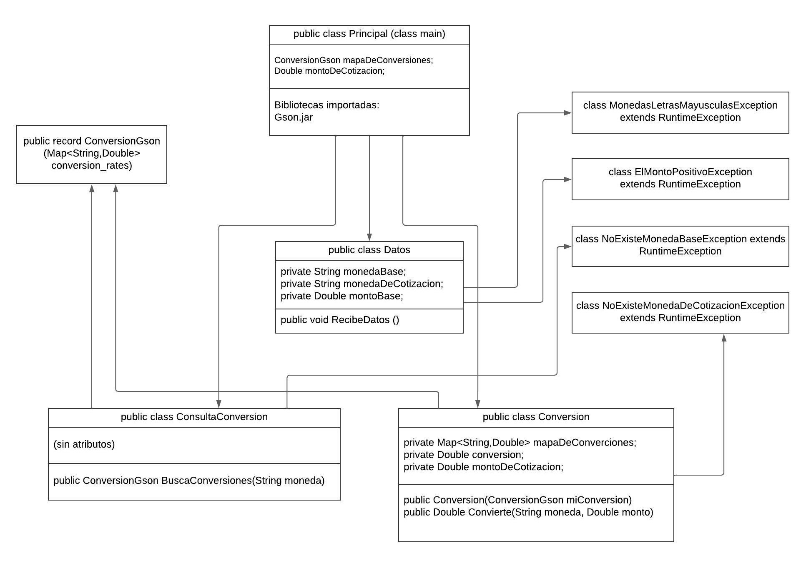

# Conversor de monedas

  

Esta aplicación hace la conversión entre cualquieras dos monedas de la lista de ISO 4217 (Three Letter Currency Code) que los cubre exchangerate-api.com.

## Descripción del proyecto
Esta aplicación fué mi tarea en ONE (Oracle Next Eucation) en la parte de Java orientado a objetos. En este proyecto se incluyeron procesos muy importantes de programación en Java.

- Definición y uso de clases Modelos
- Definición y uso de una API para obtener datos
- Uso de Biblioteca Gson.jar
- Definición y uso de clase tipo record
- Manejo de errores/exceptiones
##
La aplicación está organizada en tres paquetes (package):
- principal
    - Principal.java
- modelos
    - Datos.java
    - ConsultaConversion.java
    - Conversion.java
    - ConversionGson.java
- exceptions
    - MonedasLetrasMayusculasException.java
    - ElMontoPositivoException.java
    - NoExisteMonedaBaseException.java
    - NoExisteMonedaDeCotizacionException.java
##
En la siguinte imagen UML se muestran los atributos y métodos de las clases y la conexión entre las clases:

## Estado del proyecto
El proyecto está finalizado, pero se presta a incluir funcionalidades adicionales.

## Tecnologías usadas
Para desarollar el código usé IntelliJ.
Para preparar la imagen UML me apoye con 
